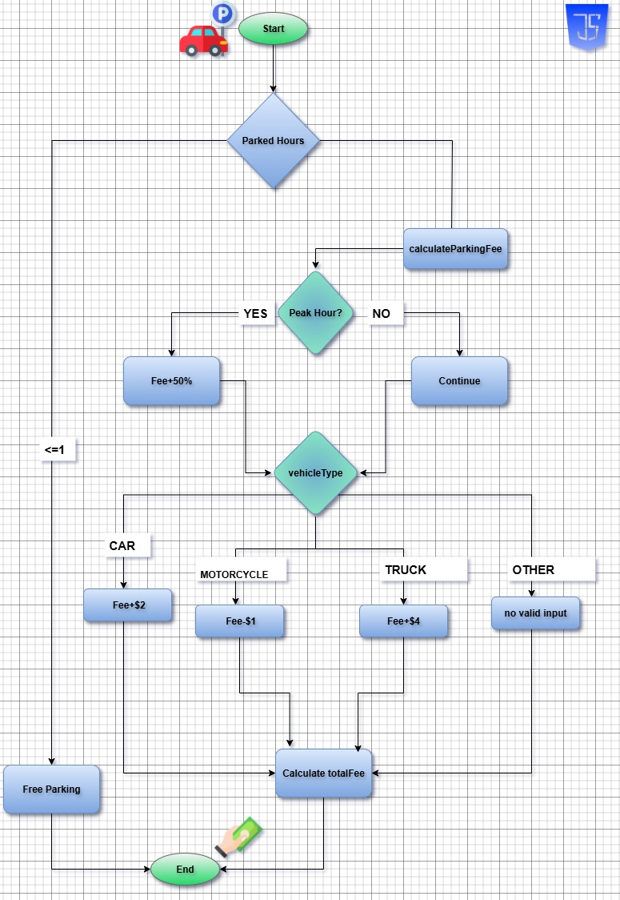

# 🚗 Proyecto 1: Calculadora de Tarifa de Estacionamiento

¡Bienvenid@ al proyecto del curso de **Mujeres Digitales**!  
Este programa, desarrollado en **JavaScript**, calcula automáticamente la tarifa de estacionamiento de un parqueadero público.  
El objetivo es ofrecer una solución eficiente y automatizada que considera diferentes variables como las horas de estacionamiento, el tipo de vehículo y si es una hora pico.

---
## 🎥 ¡Mira el Video!
Para ver una demostración en vivo del programa y cómo se ejecuta en el navegador, revisa el video incluido en el proyecto.

## 📌 Diagrama de Flujo del Programa
El siguiente diagrama visualiza la lógica detrás del código, mostrando cómo se procesa cada decisión para llegar al cálculo final de la tarifa.

---

## 🧠 Conceptos Clave del Código

Este proyecto es una excelente manera de practicar conceptos fundamentales de **JavaScript**.  

### 🔹 Variables, Tipos y Ámbito (Scope)
El programa utiliza variables para almacenar la información necesaria para los cálculos.  

- **`totalFee` (Number, Global):** Declarada con `var` fuera de cualquier función. Se puede acceder y modificar desde cualquier parte del código.  
- **`parkedHours` (Number, Local):** Declarada dentro de `calculateParkingFee()`. Solo existe en ese contexto.  
- **`vehicleType` (String, Local):** Almacena el tipo de vehículo como `"car"`, `"motorcycle"` o `"truck"`.  
- **`isPeakHour` (Boolean, Local):** Solo puede ser `true` o `false`, según corresponda.

---

### 🔹 Hoisting (Elevación)
El uso de `var` introduce el concepto de **hoisting**.  
JavaScript eleva las declaraciones de variables y funciones al inicio de su ámbito (global o de función).  

👉 Solo se eleva la **declaración**, no el valor. Antes de asignarle un valor, será `undefined`.

---

### 🔹 Estructuras de Control

- **`if-else`:** Para determinar si el estacionamiento es gratis (`parkedHours <= 1`) o si se deben calcular tarifas.  
- **`for`:** Para sumar $5 por cada hora adicional después de la primera.  
- **`switch`:** Para calcular la tarifa según el tipo de vehículo (`car`, `motorcycle`, `truck`).  

Estas estructuras permiten una lógica clara y eficiente.

---

